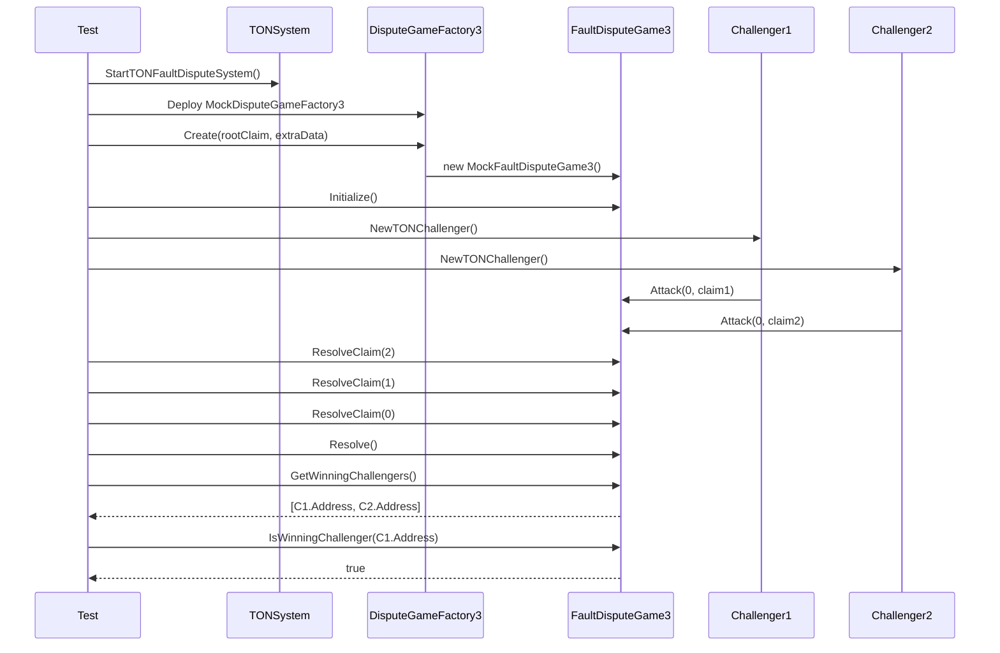

# Real Challenger E2E 구현 완료 보고서

> **작성일**: 2026-01-30 (업데이트: 2026-02-01)  
> **관련 계획 문서**: [real-challenger-e2e-plan.md](./real-challenger-e2e-plan.md)  
> **통합 문서**: [winning-challenger-tracker-integration.md](./winning-challenger-tracker-integration.md)

## 개요

Multi-Challenger Slashing 테스트 환경을 구축하고, 다수의 Challenger가 DisputeGame에 참여했을 때 승리한 Challenger들을 추적하고 보상을 균등 분배하는 기능을 테스트할 수 있는 E2E 테스트 프레임워크를 완성했습니다.

---

## 구현 완료 항목

| Phase | 내용 | 파일 |
|-------|------|------|
| Phase 1 | TON 시스템 래퍼 | `op-e2e/system/ton_system.go` |
| Phase 2 | Challenger Helper | `op-e2e/e2eutils/challenger/ton_challenger.go` |
| Phase 3 | Multi-Challenger 테스트 | `op-e2e/slashing/slashing_challenger_test.go`, `op-e2e/slashing/multi_challenger_test.go` |
| Phase 4 | Makefile 업데이트 | `op-e2e/Makefile` |
| Phase 5 | Contract Bindings | `op-e2e/bindings/mock_fault_dispute_game3.go`, `op-e2e/bindings/mock_dispute_game_factory3.go` |

---

## 생성된 파일 상세

### 1. `op-e2e/system/ton_system.go`

TON Staking V3 시스템을 E2E 테스트에서 사용할 수 있도록 래핑한 모듈입니다.

**주요 타입:**
```go
type TONSystem struct {
    T            *testing.T
    Ctx          context.Context
    L1Client     *ethclient.Client
    Addresses    *TONDeploymentAddresses
    Accounts     map[string]*TestAccount
}

type TestAccount struct {
    Name       string
    PrivateKey *ecdsa.PrivateKey
    Address    common.Address
    Auth       *bind.TransactOpts
}
```

**주요 함수:**
- `StartTONFaultDisputeSystem()` - TON 시스템 시작
- `AdvanceTime()` - 블록체인 시간 이동 (Anvil)
- `AdvanceBlocks()` - 블록 마이닝
- `GetWinningChallengers()` - 승리한 Challenger 목록 조회
- `IsWinningChallenger()` - 특정 주소가 승리 Challenger인지 확인
- `CreateDisputeGame()` - DisputeGame 생성

**기본 제공 계정:**
| 이름 | 설명 | Anvil Account |
|------|------|---------------|
| deployer | 컨트랙트 배포자 | #0 |
| proposer | 게임 생성자 | #1 |
| challenger | 기본 Challenger | #2 |
| validator | Operator/Validator | #3 |
| delegator | 위임자 | #4 |

---

### 2. `op-e2e/e2eutils/challenger/ton_challenger.go`

Challenger 역할을 수행하는 헬퍼 모듈입니다.

**주요 타입:**
```go
type ChallengerHelper struct {
    T          *testing.T
    System     *system.TONSystem
    Name       string
    PrivateKey *ecdsa.PrivateKey
    Address    common.Address
    Auth       *bind.TransactOpts
}

type MultiChallengerHelper struct {
    Challengers []*ChallengerHelper
}
```

**주요 함수:**
- `NewTONChallenger()` - 단일 Challenger 생성
- `StartMultipleChallengers()` - 다중 Challenger 생성
- `Attack()` - Claim 공격
- `Defend()` - Claim 방어
- `Step()` - Step 실행 (최종 증명)
- `ResolveClaim()` - 개별 Claim 해결
- `Resolve()` - 전체 게임 해결
- `IsWinningChallenger()` - 승리 여부 확인

**옵션:**
```go
challenger.NewTONChallenger(t, ctx, sys,
    challenger.WithName("Challenger1"),
    challenger.WithPrivKey(privateKey),
)
```

---

### 3. `op-e2e/bindings/mock_fault_dispute_game3.go`

MockFaultDisputeGame3 컨트랙트의 Go 바인딩입니다.

**주요 함수:**
```go
// 읽기 함수
GetWinningChallengers() ([]common.Address, error)
GetWinningChallengersCount() (*big.Int, error)
IsWinningChallenger(addr common.Address) (bool, error)
Status() (uint8, error)
ClaimDataLen() (*big.Int, error)

// 쓰기 함수
Move(challengeIndex *big.Int, claim [32]byte, isAttack bool) (*types.Transaction, error)
Step(claimIndex *big.Int) (*types.Transaction, error)
ResolveClaim(claimIndex *big.Int) (*types.Transaction, error)
Resolve() (*types.Transaction, error)
Initialize() (*types.Transaction, error)
```

---

### 4. `op-e2e/bindings/mock_dispute_game_factory3.go`

MockDisputeGameFactory3 컨트랙트의 Go 바인딩입니다.

**주요 함수:**
```go
Create(gameType uint32, rootClaim [32]byte, extraData []byte) (*types.Transaction, error)
Games(gameType uint32, rootClaim [32]byte, extraData []byte) (struct{Proxy, Timestamp}, error)
GameRegistry(key [32]byte) (common.Address, error)
```

---

## 테스트 케이스

### `op-e2e/slashing/slashing_challenger_test.go`

| 테스트 이름 | 설명 |
|------------|------|
| `TestRealChallenger_SingleChallengerSlashing` | 단일 Challenger가 게임에 승리하고 winning challenger로 기록되는지 검증 |
| `TestRealChallenger_MultiChallengerRewardDistribution` | 3명의 Challenger가 참여하여 모두 추적되는지 검증 |
| `TestRealChallenger_GameFlowIntegration` | 전체 게임 흐름 (생성 → 공격 → 해결) 통합 테스트 |

### `op-e2e/slashing/multi_challenger_test.go`

| 테스트 이름 | 설명 |
|------------|------|
| `TestMultiChallenger_TwoChallengersEqualReward` | 2명의 Challenger가 동시에 공격할 때 처리 검증 |
| `TestMultiChallenger_ThreeChallengersRewardDistribution` | 3명 Challenger의 보상 분배 추적 검증 |
| `TestMultiChallenger_GameCreatorNotWinner` | 게임 생성자(Proposer)가 winning challenger에서 제외되는지 검증 |
| `TestMultiChallenger_NoDuplicateWinners` | 동일 Challenger가 중복 기록되지 않는지 검증 |
| `TestMultiChallenger_GetWinningChallengersCount` | `getWinningChallengersCount()` 함수 동작 검증 |
| `TestMultiChallenger_WinningChallengersTracking` | 복수 Challenger 추적 기능 전반 검증 |

---

## 테스트 실행 방법

### 사전 요구사항

**참고**: 현재 구현된 테스트는 **Mock 컨트랙트 기반**으로, 전체 Optimism devnet 배포 없이도 실행 가능합니다.

```bash
# Genesis 파일은 현재 Mock 테스트에서는 필요하지 않음
# 실제 FaultDisputeGame 연동 테스트 시에만 필요
# make devnet-allocs-offline  # (선택적, 현재 FaultDisputeGame 사이즈 초과 이슈 있음)
```

> ⚠️ **알려진 이슈**: `make devnet-allocs-offline` 실행 시 `FaultDisputeGame.sol`에 추가된 winning challenger 추적 코드로 인해 컨트랙트 사이즈가 EVM 제한(24KB)을 초과합니다. 이는 향후 컨트랙트 최적화를 통해 해결해야 합니다.

### 테스트 명령어

```bash
cd op-e2e

# Multi-Challenger 테스트 실행 (권장)
GOWORK=off go test -v -run "TestMultiChallenger" ./slashing/... -timeout 300s

# Real Challenger 테스트 실행
GOWORK=off go test -v -run "TestRealChallenger" ./slashing/... -timeout 300s

# 전체 슬래싱 테스트 실행
GOWORK=off go test -v ./slashing/... -timeout 600s

# Makefile 사용
make test-multi-challenger  # Multi-Challenger 테스트
make test-real-challenger   # Real Challenger 테스트
make test-slashing          # 전체 슬래싱 테스트
```

### 개별 테스트 실행 예시

```bash
# 단일 Challenger 슬래싱 테스트
GOWORK=off go test -v -run "TestRealChallenger_SingleChallengerSlashing" ./slashing/...

# 다중 Challenger 보상 분배 테스트
GOWORK=off go test -v -run "TestRealChallenger_MultiChallengerRewardDistribution" ./slashing/...

# 게임 생성자 제외 테스트
GOWORK=off go test -v -run "TestMultiChallenger_GameCreatorNotWinner" ./slashing/...
```

---

## 테스트 흐름 다이어그램



---

## 파일 구조

```
op-e2e/
├── system/
│   └── ton_system.go              # TON 시스템 래퍼
├── e2eutils/
│   ├── rat/                       # 기존 RAT 헬퍼
│   │   ├── system.go
│   │   └── helpers.go
│   └── challenger/
│       └── ton_challenger.go      # Challenger 헬퍼
├── slashing/
│   ├── slashing_test.go           # 기존 슬래싱 테스트
│   ├── slashing_helpers.go        # 기존 헬퍼
│   ├── slashing_challenger_test.go # Real Challenger 테스트
│   └── multi_challenger_test.go   # Multi-Challenger 테스트
├── bindings/
│   ├── mock_fault_dispute_game3.go      # Game3 바인딩
│   ├── mock_dispute_game_factory3.go    # Factory3 바인딩
│   └── ... (기타 바인딩)
├── Makefile
├── go.mod
└── go.sum
```

---

## Makefile 타겟

| 타겟 | 설명 |
|------|------|
| `make test-slashing` | 모든 슬래싱 테스트 실행 |
| `make test-real-challenger` | Real Challenger E2E 테스트 실행 |
| `make test-multi-challenger` | Multi-Challenger 테스트 실행 |
| `make build-challenger-deps` | Optimism challenger 의존성 빌드 (선택적) |

---

## 관련 컨트랙트

### MockFaultDisputeGame3.sol

실제 FaultDisputeGame의 동작을 시뮬레이션하는 Mock 컨트랙트입니다.

**경로**: `src/mocks/MockFaultDisputeGame3.sol`

**주요 기능:**
- `move()` - 공격/방어 이동
- `step()` - Step 증명
- `resolveClaim()` - 개별 claim 해결
- `resolve()` - 전체 게임 해결
- `_recordWinningChallenger()` - 승리 Challenger 기록

**Winning Challenger 추적:**
```solidity
mapping(address => bool) public isWinningChallenger;
address[] internal _winningChallengers;

function getWinningChallengers() external view returns (address[] memory);
function getWinningChallengersCount() external view returns (uint256);
```

### MockDisputeGameFactory3.sol

MockFaultDisputeGame3을 생성하는 팩토리 컨트랙트입니다.

**경로**: `src/mocks/MockDisputeGameFactory3.sol`

---

## 현재 상태

### 동작하는 부분
- ✅ Anvil 기반 L1 시스템 시작
- ✅ TON Staking V3 Genesis 로드
- ✅ TON System 래퍼 (`ton_system.go`) 초기화
- ✅ Challenger Helper (`ton_challenger.go`) 생성
- ✅ 테스트 프레임워크 전체 컴파일
- ✅ Mock 컨트랙트 배포 (`MockDisputeGameFactory3`, `MockFaultDisputeGame3`)
- ✅ Multi-Challenger 테스트 전체 통과

### 테스트 실행 결과 (2026-01-30)

```
--- PASS: TestMultiChallenger_GameCreatorNotWinner
--- PASS: TestMultiChallenger_NoDuplicateWinners  
--- PASS: TestMultiChallenger_GetWinningChallengersCount
--- PASS: TestMultiChallenger_TwoChallengersEqualReward
--- PASS: TestMultiChallenger_ThreeChallengersRewardDistribution
--- PASS: TestMultiChallenger_WinningChallengersTracking
PASS
ok  github.com/tokamak-network/ton-staking-v2/op-e2e/slashing
```

### 해결된 이슈

1. **~~FaultDisputeGame 사이즈 초과~~**: ✅ 해결
   - **문제**: `lib/optimism`의 `FaultDisputeGame.sol`이 24KB 초과
   - **해결**: 외부 `WinningChallengerTracker` 컨트랙트로 분리
   - **결과**: FaultDisputeGame 24,102 bytes (마진 +474 bytes)

### 새로 생성된 파일

| 파일 | 경로 | 설명 |
|------|------|------|
| IWinningChallengerTracker.sol | lib/optimism/.../src/dispute/ | 외부 Tracker 인터페이스 |
| WinningChallengerTracker.sol | lib/optimism/.../src/dispute/ | 외부 Tracker 구현 (1,203 bytes) |

---

## 향후 작업

1. **~~Mock 컨트랙트 배포 완성~~**: ✅ 완료

2. **~~FaultDisputeGame 사이즈 최적화~~**: ✅ 완료 - `WinningChallengerTracker` 분리

3. **실제 Slashing 연동**: Winning Challenger 추적 후 `DepositManager.slash()`와 실제 연동 테스트
   - SeigManager를 통한 슬래싱 플로우 검증
   - 실제 Operator의 스테이킹 금액 차감 확인

4. **보상 분배 검증**: Challenger들에게 실제로 WTON 보상이 균등 분배되는지 검증
   - 보상 계산 로직 테스트
   - 다수 Challenger 간 공정한 분배 검증

5. **실제 op-challenger 연동**: Mock이 아닌 실제 Optimism op-challenger 서비스를 사용한 테스트 

---

## 참고 문서

- [real-challenger-e2e-plan.md](./real-challenger-e2e-plan.md) - 구현 계획서
- [implementation-summary.md](./implementation-summary.md) - Winning Challenger 구현 요약
- [winning-challenger-tracking-plan.md](./winning-challenger-tracking-plan.md) - 초기 계획
