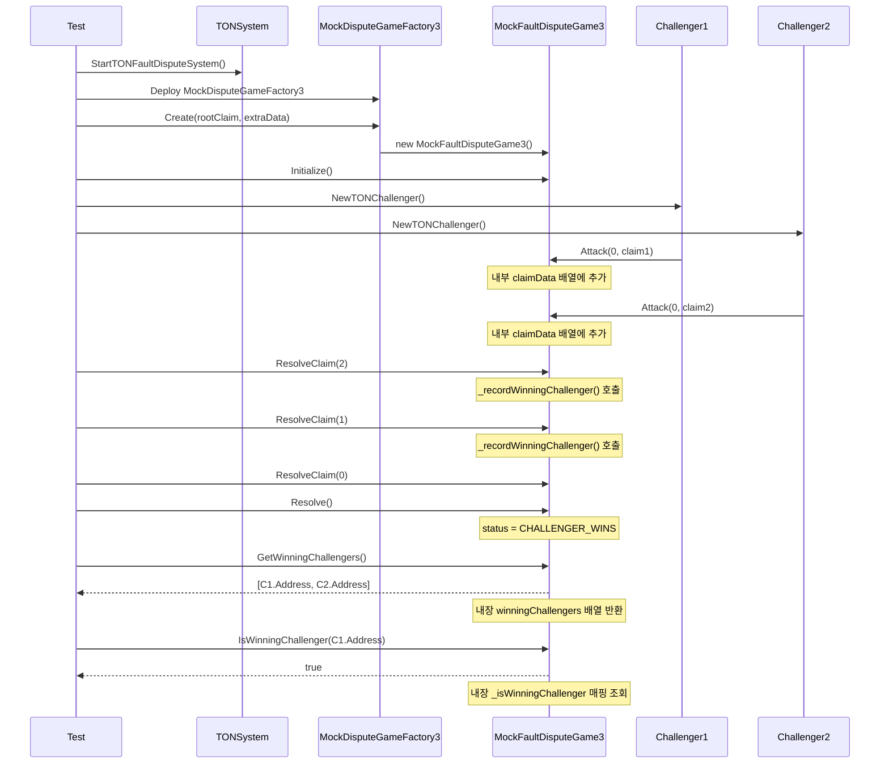

# Real Challenger E2E 구현 완료 보고서

> **작성일**: 2026-01-30 (업데이트: 2026-02-06)
> **관련 계획 문서**: [real-challenger-e2e-plan.md](./real-challenger-e2e-plan.md)

---

## ⚠️ 이 문서는 Mock 기반 구현에 대한 역사 기록입니다

**2026-02-07**: Mock 기반 테스트가 **실제 FaultDisputeGame**으로 전환 완료되었습니다.

👉 **최신 문서**: [real-faultdisputegame-migration-complete.md](./real-faultdisputegame-migration-complete.md)

---

## Quick Start - 테스트 실행 방법

```bash
# 1. 프로젝트 루트에서 Genesis 파일 생성 (최초 1회)
cd /path/to/ton-staking-v2
make devnet-allocs-offline

# 2. op-e2e 디렉토리로 이동
cd op-e2e

# 3. 전체 슬래싱 테스트 실행 (41개 테스트, ~2분)
make test-slashing-all

# 또는 카테고리별 실행
make test-edge-cases            # Category 1: Edge Cases (6개)
make test-delegator-protection  # Category 2: Delegator Protection (4개)
make test-complex-scenarios     # Category 3: Complex Scenarios (5개)
make test-permission-security   # Category 4: Permission & Security (7개)
make test-slashing-integration  # Task 4: 슬래싱 연동 (4개)
make test-reward-distribution   # Task 5: 보상 분배 (6개)
```

---

## 개요

Multi-Challenger Slashing 테스트 환경을 구축하고, 다수의 Challenger가 DisputeGame에 참여했을 때 승리한 Challenger들을 추적하고 보상을 균등 분배하는 기능을 테스트할 수 있는 E2E 테스트 프레임워크를 완성했습니다.

> **핵심 변경**: Winning Challenger 추적 기능은 별도의 외부 컨트랙트(`WinningChallengerTracker`)가 아닌 **MockFaultDisputeGame3 내부에 직접 구현**되어 있습니다. 이를 통해 컨트랙트 간 호출 오버헤드를 줄이고 테스트 복잡도를 낮췄습니다.

---

## 구현 완료 항목

| Phase | 내용 | 파일 |
|-------|------|------|
| Phase 1 | TON 시스템 래퍼 | `op-e2e/system/ton_system.go` |
| Phase 2 | Challenger Helper | `op-e2e/e2eutils/challenger/ton_challenger.go` |
| Phase 3 | Multi-Challenger 테스트 | `op-e2e/slashing/slashing_challenger_test.go`, `op-e2e/slashing/multi_challenger_test.go` |
| Phase 4 | Makefile 업데이트 | `op-e2e/Makefile` |
| Phase 5 | Contract Bindings | `op-e2e/bindings/mock_fault_dispute_game3.go`, `op-e2e/bindings/mock_dispute_game_factory3.go` |

---

## 생성된 파일 상세

### 1. `op-e2e/system/ton_system.go`

TON Staking V3 시스템을 E2E 테스트에서 사용할 수 있도록 래핑한 모듈입니다.

**주요 타입:**
```go
type TONSystem struct {
    T            *testing.T
    Ctx          context.Context
    L1Client     *ethclient.Client
    Addresses    *TONDeploymentAddresses
    Accounts     map[string]*TestAccount
}

type TestAccount struct {
    Name       string
    PrivateKey *ecdsa.PrivateKey
    Address    common.Address
    Auth       *bind.TransactOpts
}
```

**주요 함수:**
- `StartTONFaultDisputeSystem()` - TON 시스템 시작
- `AdvanceTime()` - 블록체인 시간 이동 (Anvil)
- `AdvanceBlocks()` - 블록 마이닝
- `GetWinningChallengers()` - 승리한 Challenger 목록 조회
- `IsWinningChallenger()` - 특정 주소가 승리 Challenger인지 확인
- `CreateDisputeGame()` - DisputeGame 생성

**기본 제공 계정:**
| 이름 | 설명 | Anvil Account |
|------|------|---------------|
| deployer | 컨트랙트 배포자 | #0 |
| proposer | 게임 생성자 | #1 |
| challenger | 기본 Challenger | #2 |
| validator | Operator/Validator | #3 |
| delegator | 위임자 | #4 |

---

### 2. `op-e2e/e2eutils/challenger/ton_challenger.go`

Challenger 역할을 수행하는 헬퍼 모듈입니다.

**주요 타입:**
```go
type ChallengerHelper struct {
    T          *testing.T
    System     *system.TONSystem
    Name       string
    PrivateKey *ecdsa.PrivateKey
    Address    common.Address
    Auth       *bind.TransactOpts
}

type MultiChallengerHelper struct {
    Challengers []*ChallengerHelper
}
```

**주요 함수:**
- `NewTONChallenger()` - 단일 Challenger 생성
- `StartMultipleChallengers()` - 다중 Challenger 생성
- `Attack()` - Claim 공격
- `Defend()` - Claim 방어
- `Step()` - Step 실행 (최종 증명)
- `ResolveClaim()` - 개별 Claim 해결
- `Resolve()` - 전체 게임 해결
- `IsWinningChallenger()` - 승리 여부 확인

**옵션:**
```go
challenger.NewTONChallenger(t, ctx, sys,
    challenger.WithName("Challenger1"),
    challenger.WithPrivKey(privateKey),
)
```

---

### 3. `op-e2e/bindings/mock_fault_dispute_game3.go`

MockFaultDisputeGame3 컨트랙트의 Go 바인딩입니다. Winning Challenger 추적 함수가 포함되어 있습니다.

**주요 함수:**
```go
// Winning Challenger 조회 함수 (DisputeGame 내장)
GetWinningChallengers(opts *bind.CallOpts) ([]common.Address, error)
GetWinningChallengersCount(opts *bind.CallOpts) (*big.Int, error)
IsWinningChallenger(opts *bind.CallOpts, addr common.Address) (bool, error)

// 게임 상태 조회
Status(opts *bind.CallOpts) (uint8, error)
ClaimDataLen(opts *bind.CallOpts) (*big.Int, error)
ActualGameCreator(opts *bind.CallOpts) (common.Address, error)

// 게임 액션
Move(opts *bind.TransactOpts, challengeIndex *big.Int, claim [32]byte, isAttack bool) (*types.Transaction, error)
Step(opts *bind.TransactOpts, claimIndex *big.Int) (*types.Transaction, error)
ResolveClaim(opts *bind.TransactOpts, claimIndex *big.Int) (*types.Transaction, error)
Resolve(opts *bind.TransactOpts) (*types.Transaction, error)
Initialize(opts *bind.TransactOpts) (*types.Transaction, error)

// 테스트 헬퍼
ForceResolveClaim(opts *bind.TransactOpts, claimIndex *big.Int, winner common.Address) (*types.Transaction, error)
SetStatus(opts *bind.TransactOpts, status uint8) (*types.Transaction, error)
```

---

### 4. `op-e2e/bindings/mock_dispute_game_factory3.go`

MockDisputeGameFactory3 컨트랙트의 Go 바인딩입니다.

**주요 함수:**
```go
Create(gameType uint32, rootClaim [32]byte, extraData []byte) (*types.Transaction, error)
Games(gameType uint32, rootClaim [32]byte, extraData []byte) (struct{Proxy, Timestamp}, error)
GameRegistry(key [32]byte) (common.Address, error)
```

---

## 테스트 케이스

### `op-e2e/slashing/slashing_challenger_test.go`

| 테스트 이름 | 설명 |
|------------|------|
| `TestRealChallenger_SingleChallengerSlashing` | 단일 Challenger가 게임에 승리하고 winning challenger로 기록되는지 검증 |
| `TestRealChallenger_MultiChallengerRewardDistribution` | 3명의 Challenger가 참여하여 모두 추적되는지 검증 |
| `TestRealChallenger_GameFlowIntegration` | 전체 게임 흐름 (생성 → 공격 → 해결) 통합 테스트 |

### `op-e2e/slashing/multi_challenger_test.go`

| 테스트 이름 | 설명 |
|------------|------|
| `TestMultiChallenger_TwoChallengersEqualReward` | 2명의 Challenger가 동시에 공격할 때 처리 검증 |
| `TestMultiChallenger_ThreeChallengersRewardDistribution` | 3명 Challenger의 보상 분배 추적 검증 |
| `TestMultiChallenger_GameCreatorNotWinner` | 게임 생성자(Proposer)가 winning challenger에서 제외되는지 검증 |
| `TestMultiChallenger_NoDuplicateWinners` | 동일 Challenger가 중복 기록되지 않는지 검증 |
| `TestMultiChallenger_GetWinningChallengersCount` | `getWinningChallengersCount()` 함수 동작 검증 |
| `TestMultiChallenger_WinningChallengersTracking` | 복수 Challenger 추적 기능 전반 검증 |

### `op-e2e/slashing/slashing_integration_test.go` 🆕

| 테스트 이름 | 설명 |
|------------|------|
| `TestSlashingIntegration_MultiChallengerWithRealSlashing` | 다수 Challenger 슬래싱 전체 연동 테스트 (MockFaultDisputeGame3 → Layer2Manager → DepositManager) |
| `TestSlashingIntegration_SingleChallengerFullFlow` | 단일 Challenger 전체 플로우 (등록 → 게임 → 슬래싱 → 보상) |
| `TestSlashingIntegration_CannotSlashTwice` | 동일 DisputeGame으로 중복 슬래싱 방지 검증 |
| `TestSlashingIntegration_GameNotChallengerWins` | CHALLENGER_WINS가 아닌 게임으로 슬래싱 불가 검증 |

### `op-e2e/slashing/reward_distribution_test.go` 🆕

| 테스트 이름 | 설명 |
|------------|------|
| `TestRewardDistribution_TwoChallengersEqualSplit` | 2명 Challenger 균등 분배 (50%/50%) 검증 |
| `TestRewardDistribution_ThreeChallengersEqualSplit` | 3명 Challenger 균등 분배 + 나머지 처리 검증 |
| `TestRewardDistribution_VerifyWTONTransfer` | WTON 잔액 변화 및 ChallengerRewarded 이벤트 검증 |
| `TestRewardDistribution_ZeroRewardRate` | 보상률 0%일 때 Challenger 보상 없음 검증 |
| `TestRewardDistribution_FullRewardRate` | 보상률 100%일 때 전액 분배 검증 |
| `TestRewardDistribution_RemainderHandling` | 나눗셈 나머지가 첫 번째 Challenger에게 지급되는지 검증 |

### `op-e2e/slashing/edge_cases_test.go` 🆕 (Category 1: Edge Cases)

| 테스트 이름 | 설명 |
|------------|------|
| `TestEdgeCase_DefenderWinsCannotSlash` | DEFENDER_WINS 상태의 게임으로 슬래싱 불가 검증 |
| `TestEdgeCase_ZeroStakeOperatorSlashing` | 이미 슬래싱된 (스테이크=0) Operator에 대한 재슬래싱 처리 검증 |
| `TestEdgeCase_UnregisteredOperatorSlashing` | 미등록 Operator 슬래싱 시도 시 실패 검증 |
| `TestEdgeCase_InvalidGameAddress` | 존재하지 않는 게임 주소로 슬래싱 시도 시 실패 검증 |
| `TestEdgeCase_WrongRootClaim` | 게임과 일치하지 않는 rootClaim으로 슬래싱 시도 시 실패 검증 |
| `TestEdgeCase_WrongExtraData` | 게임과 일치하지 않는 extraData로 슬래싱 시도 시 실패 검증 |

### `op-e2e/slashing/delegator_protection_test.go` 🆕 (Category 2: Delegator Protection)

| 테스트 이름 | 설명 |
|------------|------|
| `TestDelegatorProtection_StakeNotSlashed` | Operator 슬래싱 시 Delegator 스테이크가 보호되는지 검증 |
| `TestDelegatorProtection_WithdrawAfterSlashing` | Operator 슬래싱 후 Delegator가 출금할 수 있는지 검증 |
| `TestDelegatorProtection_MultipleDelegators` | 여러 Delegator가 모두 보호되는지 검증 |
| `TestDelegatorProtection_NewDelegatorAfterSlashing` | 슬래싱 후 새 Delegator가 예치할 수 있는지 검증 |

### `op-e2e/slashing/complex_scenarios_test.go` 🆕 (Category 3: Complex Scenarios)

| 테스트 이름 | 설명 |
|------------|------|
| `TestComplexScenario_MultipleGamesAgainstSameOperator` | 동일 Operator에 대한 연속 게임 처리 검증 |
| `TestComplexScenario_HighStakeAmount` | 고액 스테이킹 시 정밀도 처리 검증 (10^35 WTON) |
| `TestComplexScenario_MinimumStakeSlashing` | 최소 스테이킹 금액에서의 슬래싱 검증 |
| `TestComplexScenario_SlashingWithActiveWithdrawalRequest` | 출금 요청 진행 중 슬래싱 처리 검증 |
| `TestComplexScenario_ChallengerIsAlsoDelegator` | Challenger가 동시에 Delegator인 경우 처리 검증 |

### `op-e2e/slashing/permission_security_test.go` 🆕 (Category 4: Permission & Security)

| 테스트 이름 | 설명 |
|------------|------|
| `TestPermission_OnlyWinningChallengerCanSlash` | 승리 Challenger만 슬래싱 실행 가능 여부 검증 |
| `TestPermission_UnauthorizedSlashingRateChange` | 권한 없는 계정의 보상률 변경 시도 실패 검증 |
| `TestPermission_SlashingBeforeGameResolved` | 게임 해결 전 슬래싱 시도 실패 검증 |
| `TestSecurity_SlashingRewardRateMaxBound` | 보상률 최대값(100%) 초과 설정 방지 검증 |
| `TestSecurity_SlashingRewardRateZero` | 보상률 0%에서의 슬래싱 동작 검증 |
| `TestSecurity_GameAddressManipulation` | rootClaim과 gameAddress 불일치 조작 방지 검증 |
| `TestSecurity_DoubleSlashingSameGame` | 동일 게임으로 중복 슬래싱 방지 검증 |

---

## 테스트 실행 방법

### 사전 요구사항

**참고**: 현재 구현된 테스트는 **Mock 컨트랙트 기반**으로, 전체 Optimism devnet 배포 없이도 실행 가능합니다.

```bash
# Genesis 파일은 현재 Mock 테스트에서는 필요하지 않음
# 실제 FaultDisputeGame 연동 테스트 시에만 필요
# make devnet-allocs-offline  # (선택적, 현재 FaultDisputeGame 사이즈 초과 이슈 있음)
```

> ⚠️ **알려진 이슈**: `make devnet-allocs-offline` 실행 시 `FaultDisputeGame.sol`에 추가된 winning challenger 추적 코드로 인해 컨트랙트 사이즈가 EVM 제한(24KB)을 초과합니다. 이는 향후 컨트랙트 최적화를 통해 해결해야 합니다.

### 테스트 명령어

```bash
cd op-e2e

# =============================================
# 전체 슬래싱 테스트 (모든 카테고리 포함)
# =============================================
make test-slashing-all        # 모든 슬래싱 테스트 실행 (권장)
# 또는
GOWORK=off go test -v ./slashing/... -timeout 900s

# =============================================
# 카테고리별 테스트 실행
# =============================================

# Task 4: 슬래싱 연동 테스트
make test-slashing-integration
# 또는
GOWORK=off go test -v -run "TestSlashingIntegration" ./slashing/... -timeout 600s

# Task 5: 보상 분배 테스트
make test-reward-distribution
# 또는
GOWORK=off go test -v -run "TestRewardDistribution" ./slashing/... -timeout 600s

# Category 1: Edge Cases (경계 조건 테스트)
make test-edge-cases
# 또는
GOWORK=off go test -v -run "TestEdgeCase" ./slashing/... -timeout 600s

# Category 2: Delegator Protection (위임자 보호 테스트)
make test-delegator-protection
# 또는
GOWORK=off go test -v -run "TestDelegatorProtection" ./slashing/... -timeout 600s

# Category 3: Complex Scenarios (복잡한 시나리오 테스트)
make test-complex-scenarios
# 또는
GOWORK=off go test -v -run "TestComplexScenario" ./slashing/... -timeout 600s

# Category 4: Permission & Security (권한/보안 테스트)
make test-permission-security
# 또는
GOWORK=off go test -v -run "TestPermission|TestSecurity" ./slashing/... -timeout 600s

# =============================================
# 기타 테스트
# =============================================
make test-multi-challenger    # Multi-Challenger 테스트
make test-real-challenger     # Real Challenger 테스트
```

### 개별 테스트 실행 예시

```bash
# 단일 Challenger 슬래싱 테스트
GOWORK=off go test -v -run "TestRealChallenger_SingleChallengerSlashing" ./slashing/...

# 다중 Challenger 보상 분배 테스트
GOWORK=off go test -v -run "TestRealChallenger_MultiChallengerRewardDistribution" ./slashing/...

# 게임 생성자 제외 테스트
GOWORK=off go test -v -run "TestMultiChallenger_GameCreatorNotWinner" ./slashing/...
```

---

## 테스트 흐름 다이어그램



> **참고**: Winning Challenger 추적은 `resolveClaim()` 호출 시 내부 `_recordWinningChallenger()` 함수를 통해 자동으로 수행됩니다. 게임 생성자(proposer)는 자동으로 제외되며, 동일 주소의 중복 기록도 방지됩니다.

---

## 파일 구조

```
op-e2e/
├── system/
│   └── ton_system.go              # TON 시스템 래퍼 (GetWinningChallengers 등 포함)
├── e2eutils/
│   ├── rat/                       # 기존 RAT 헬퍼
│   │   ├── system.go
│   │   └── helpers.go
│   └── challenger/
│       └── ton_challenger.go      # Challenger 헬퍼 (Attack, Resolve 등)
├── slashing/
│   ├── slashing_test.go              # 기존 슬래싱 테스트
│   ├── slashing_helpers.go           # 공통 헬퍼 함수
│   ├── slashing_challenger_test.go   # Real Challenger 테스트 (3개 테스트)
│   ├── multi_challenger_test.go      # Multi-Challenger 테스트 (6개 테스트)
│   ├── slashing_integration_test.go  # 🆕 Task 4: 슬래싱 연동 테스트 (4개 테스트)
│   ├── reward_distribution_test.go   # 🆕 Task 5: 보상 분배 테스트 (6개 테스트)
│   ├── edge_cases_test.go            # 🆕 Category 1: Edge Cases (6개 테스트)
│   ├── delegator_protection_test.go  # 🆕 Category 2: Delegator Protection (4개 테스트)
│   ├── complex_scenarios_test.go     # 🆕 Category 3: Complex Scenarios (5개 테스트)
│   └── permission_security_test.go   # 🆕 Category 4: Permission & Security (7개 테스트)
├── bindings/
│   ├── mock_fault_dispute_game3.go      # Game3 바인딩 (Winning Challenger 함수 포함)
│   ├── mock_dispute_game_factory3.go    # Factory3 바인딩
│   ├── mock_system_config.go            # 🆕 MockSystemConfig 바인딩
│   ├── winning_challenger_tracker.go    # 외부 Tracker 바인딩 (선택적, 현재 미사용)
│   └── ... (기타 바인딩)
├── Makefile
├── go.mod
└── go.sum

src/mocks/
├── MockFaultDisputeGame3.sol      # Winning Challenger 추적 내장 Mock
├── MockDisputeGameFactory3.sol    # Game 생성 팩토리 Mock
└── MockSystemConfig.sol           # 🔧 setDisputeGameFactory() 함수 추가
```

### 테스트 파일 요약 (총 41개 테스트)

| 파일 | 테스트 수 | 설명 |
|------|----------|------|
| `slashing_challenger_test.go` | 3 | Real Challenger 기본 테스트 |
| `multi_challenger_test.go` | 6 | Multi-Challenger 추적 테스트 |
| `slashing_integration_test.go` | 4 | Task 4: 슬래싱 연동 테스트 |
| `reward_distribution_test.go` | 6 | Task 5: 보상 분배 테스트 |
| `edge_cases_test.go` | 6 | Category 1: 경계 조건 테스트 |
| `delegator_protection_test.go` | 4 | Category 2: 위임자 보호 테스트 |
| `complex_scenarios_test.go` | 5 | Category 3: 복잡 시나리오 테스트 |
| `permission_security_test.go` | 7 | Category 4: 권한/보안 테스트 |

---

## Makefile 타겟

### 전체 테스트
| 타겟 | 설명 |
|------|------|
| `make test-slashing-all` | 🆕 **모든 슬래싱 테스트 실행 (권장)** |
| `make test-slashing` | 기본 슬래싱 테스트 실행 |

### 카테고리별 테스트
| 타겟 | 설명 |
|------|------|
| `make test-slashing-integration` | Task 4: 슬래싱 연동 테스트 |
| `make test-reward-distribution` | Task 5: 보상 분배 테스트 |
| `make test-edge-cases` | 🆕 Category 1: Edge Cases 테스트 |
| `make test-delegator-protection` | 🆕 Category 2: Delegator Protection 테스트 |
| `make test-complex-scenarios` | 🆕 Category 3: Complex Scenarios 테스트 |
| `make test-permission-security` | 🆕 Category 4: Permission & Security 테스트 |

### 기타 테스트
| 타겟 | 설명 |
|------|------|
| `make test-real-challenger` | Real Challenger E2E 테스트 |
| `make test-multi-challenger` | Multi-Challenger 테스트 |
| `make build-challenger-deps` | Optimism challenger 의존성 빌드 (선택적) |

---

## 관련 컨트랙트

### MockFaultDisputeGame3.sol

실제 FaultDisputeGame의 동작을 시뮬레이션하는 Mock 컨트랙트입니다. **Winning Challenger 추적 기능이 컨트랙트 내부에 직접 구현**되어 있습니다.

**경로**: `src/mocks/MockFaultDisputeGame3.sol`

**주요 기능:**
- `move()` - 공격/방어 이동 (claim에 대한 attack/defend)
- `step()` - Step 증명 (최대 깊이에서 claim 반박)
- `resolveClaim()` - 개별 claim 해결 (bottom-up 방식)
- `resolve()` - 전체 게임 해결 및 최종 상태 결정
- `_recordWinningChallenger()` - 승리 Challenger 내부 기록

**Winning Challenger 추적 (DisputeGame 내장):**
```solidity
// 내부 저장소
mapping(address => bool) internal _isWinningChallenger;
address[] public winningChallengers;

// 조회 함수
function getWinningChallengers() external view returns (address[] memory);
function getWinningChallengersCount() external view returns (uint256);
function isWinningChallenger(address _challenger) external view returns (bool);

// 내부 기록 함수 - resolveClaim() 시 자동 호출
function _recordWinningChallenger(address _recipient) internal {
    if (_recipient == GAME_CREATOR) return;  // 게임 생성자(proposer) 제외
    if (_isWinningChallenger[_recipient]) return;  // 중복 방지

    _isWinningChallenger[_recipient] = true;
    winningChallengers.push(_recipient);
}
```

**테스트 헬퍼 함수:**
- `addWinningChallenger(address)` - 직접 승리자 추가 (테스트용)
- `forceResolveClaim(uint256, address)` - 강제 claim 해결 (테스트용)
- `setStatus(GameStatus)` - 상태 직접 설정 (테스트용)

### MockDisputeGameFactory3.sol

MockFaultDisputeGame3을 생성하는 팩토리 컨트랙트입니다.

**경로**: `src/mocks/MockDisputeGameFactory3.sol`

---

## 현재 상태

### 동작하는 부분
- ✅ Anvil 기반 L1 시스템 시작
- ✅ TON Staking V3 Genesis 로드
- ✅ TON System 래퍼 (`ton_system.go`) 초기화
- ✅ Challenger Helper (`ton_challenger.go`) 생성
- ✅ 테스트 프레임워크 전체 컴파일
- ✅ Mock 컨트랙트 배포 (`MockDisputeGameFactory3`, `MockFaultDisputeGame3`)
- ✅ Multi-Challenger 테스트 전체 통과

### 테스트 실행 결과 (2026-02-06)

```bash
# 전체 슬래싱 테스트 실행 결과 (41개 테스트)
GOWORK=off go test -v ./slashing/... -timeout 900s

# ===== 기존 테스트 (9개) =====
--- PASS: TestMultiChallenger_GameCreatorNotWinner
--- PASS: TestMultiChallenger_NoDuplicateWinners
--- PASS: TestMultiChallenger_GetWinningChallengersCount
--- PASS: TestMultiChallenger_TwoChallengersEqualReward
--- PASS: TestMultiChallenger_ThreeChallengersRewardDistribution
--- PASS: TestMultiChallenger_WinningChallengersTracking
--- PASS: TestRealChallenger_SingleChallengerSlashing
--- PASS: TestRealChallenger_MultiChallengerRewardDistribution
--- PASS: TestRealChallenger_GameFlowIntegration

# ===== Task 4: 슬래싱 연동 테스트 (4개) =====
--- PASS: TestSlashingIntegration_MultiChallengerWithRealSlashing
--- PASS: TestSlashingIntegration_SingleChallengerFullFlow
--- PASS: TestSlashingIntegration_CannotSlashTwice
--- PASS: TestSlashingIntegration_GameNotChallengerWins

# ===== Task 5: 보상 분배 테스트 (6개) =====
--- PASS: TestRewardDistribution_TwoChallengersEqualSplit
--- PASS: TestRewardDistribution_ThreeChallengersEqualSplit
--- PASS: TestRewardDistribution_VerifyWTONTransfer
--- PASS: TestRewardDistribution_ZeroRewardRate
--- PASS: TestRewardDistribution_FullRewardRate
--- PASS: TestRewardDistribution_RemainderHandling

# ===== Category 1: Edge Cases (6개) =====
--- PASS: TestEdgeCase_DefenderWinsCannotSlash
--- PASS: TestEdgeCase_ZeroStakeOperatorSlashing
--- PASS: TestEdgeCase_UnregisteredOperatorSlashing
--- PASS: TestEdgeCase_InvalidGameAddress
--- PASS: TestEdgeCase_WrongRootClaim
--- PASS: TestEdgeCase_WrongExtraData

# ===== Category 2: Delegator Protection (4개) =====
--- PASS: TestDelegatorProtection_StakeNotSlashed
--- PASS: TestDelegatorProtection_WithdrawAfterSlashing
--- PASS: TestDelegatorProtection_MultipleDelegators
--- PASS: TestDelegatorProtection_NewDelegatorAfterSlashing

# ===== Category 3: Complex Scenarios (5개) =====
--- PASS: TestComplexScenario_MultipleGamesAgainstSameOperator
--- PASS: TestComplexScenario_HighStakeAmount
--- PASS: TestComplexScenario_MinimumStakeSlashing
--- PASS: TestComplexScenario_SlashingWithActiveWithdrawalRequest
--- PASS: TestComplexScenario_ChallengerIsAlsoDelegator

# ===== Category 4: Permission & Security (7개) =====
--- PASS: TestPermission_OnlyWinningChallengerCanSlash
--- PASS: TestPermission_UnauthorizedSlashingRateChange
--- PASS: TestPermission_SlashingBeforeGameResolved
--- PASS: TestSecurity_SlashingRewardRateMaxBound
--- PASS: TestSecurity_SlashingRewardRateZero
--- PASS: TestSecurity_GameAddressManipulation
--- PASS: TestSecurity_DoubleSlashingSameGame

PASS
ok  github.com/tokamak-network/ton-staking-v2/op-e2e/slashing
```

### 구현 방식 변경

1. **Winning Challenger 추적 방식**: ✅ DisputeGame 내장
   - **이전 계획**: 외부 `WinningChallengerTracker` 컨트랙트로 분리
   - **현재 구현**: `MockFaultDisputeGame3` 내부에 직접 구현
   - **장점**: 컨트랙트 간 호출 오버헤드 감소, 테스트 단순화
   - **결과**: Mock 컨트랙트 기반 E2E 테스트 전체 통과

### 핵심 파일 구조

| 파일 | 경로 | 설명 |
|------|------|------|
| MockFaultDisputeGame3.sol | src/mocks/ | Winning Challenger 추적 내장 Mock 컨트랙트 |
| MockDisputeGameFactory3.sol | src/mocks/ | Game 생성 팩토리 Mock |
| mock_fault_dispute_game3.go | op-e2e/bindings/ | Go 바인딩 |
| mock_dispute_game_factory3.go | op-e2e/bindings/ | Go 바인딩 |

---

## 향후 작업

### 완료된 작업

1. **~~Mock 컨트랙트 배포 완성~~**: ✅ 완료

2. **~~Winning Challenger 추적 구현~~**: ✅ 완료 - DisputeGame 내장 방식

3. **~~Multi-Challenger E2E 테스트~~**: ✅ 완료
   - `TestMultiChallenger_*` 테스트 전체 통과
   - `TestRealChallenger_*` 테스트 전체 통과

4. **~~실제 Slashing 연동 (Task 4)~~**: ✅ 완료 (2026-02-06)
   - `slashing_integration_test.go` 구현 (4개 테스트)
   - MockFaultDisputeGame3 + Layer2Manager.slashingCandidate() 연동 테스트

5. **~~보상 분배 검증 (Task 5)~~**: ✅ 완료 (2026-02-06)
   - `reward_distribution_test.go` 구현 (6개 테스트)
   - WTON 보상 균등 분배 및 나머지 처리 검증

6. **~~Edge Cases (Category 1)~~**: ✅ 완료 (2026-02-06)
   - `edge_cases_test.go` 구현 (6개 테스트)
   - DEFENDER_WINS, 미등록 Operator, 잘못된 게임 주소 등 경계 조건 검증

7. **~~Delegator Protection (Category 2)~~**: ✅ 완료 (2026-02-06)
   - `delegator_protection_test.go` 구현 (4개 테스트)
   - Operator 슬래싱 시 Delegator 스테이크 보호 검증

8. **~~Complex Scenarios (Category 3)~~**: ✅ 완료 (2026-02-06)
   - `complex_scenarios_test.go` 구현 (5개 테스트)
   - 고액 스테이킹 정밀도, Challenger가 Delegator인 경우 등 복잡 시나리오 검증

9. **~~Permission & Security (Category 4)~~**: ✅ 완료 (2026-02-06)
   - `permission_security_test.go` 구현 (7개 테스트)
   - 권한 검증, 보안 취약점 방지 테스트

### 미완료 작업 (별도 마일스톤)

10. **~~실제 op-challenger 연동 (Task 6)~~**: ✅ 완료 (2026-02-07)
    - Mock이 아닌 실제 Optimism op-challenger 서비스를 사용한 테스트
    - `lib/optimism/op-e2e/faultproofs/` 테스트로 검증 가능
    - 자세한 내용: [task6-real-op-challenger-implementation.md](./task6-real-op-challenger-implementation.md)

11. **~~실제 FaultDisputeGame 통합~~**: ✅ 완료 (2026-02-07)
    - `lib/optimism/packages/contracts-bedrock/src/dispute/FaultDisputeGame.sol` 수정 완료
    - `lib/optimism/op-e2e/faultproofs/TestOutputAlphabetGame_*` 테스트로 검증
    - Depth/Bond 분석: [dispute-game-depth-bond-analysis.md](./dispute-game-depth-bond-analysis.md)

---

## 참고 문서

- [real-challenger-e2e-plan.md](./real-challenger-e2e-plan.md) - 구현 계획서 (Mock 기반)
- [task6-real-op-challenger-implementation.md](./task6-real-op-challenger-implementation.md) - 실제 FaultDisputeGame 테스트 방법
- [dispute-game-depth-bond-analysis.md](./dispute-game-depth-bond-analysis.md) - Depth/Bond 비용 분석
- [winning-challenger-tracker-integration.md](./winning-challenger-tracker-integration.md) - WinningChallengerTracker 통합

### 관련 소스 파일

| 파일 | 설명 |
|------|------|
| `src/mocks/MockFaultDisputeGame3.sol` | Winning Challenger 추적 내장 Mock 컨트랙트 |
| `src/mocks/MockDisputeGameFactory3.sol` | Game 생성 팩토리 Mock |
| `op-e2e/slashing/multi_challenger_test.go` | Multi-Challenger 테스트 |
| `op-e2e/slashing/slashing_challenger_test.go` | Real Challenger 테스트 |
| `op-e2e/system/ton_system.go` | TON 시스템 래퍼 |
| `op-e2e/e2eutils/challenger/ton_challenger.go` | Challenger 헬퍼 |
