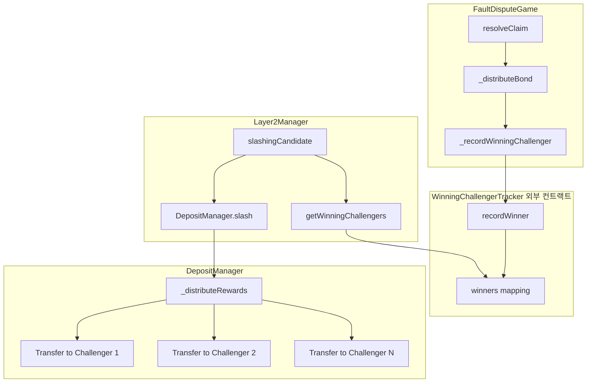

# Winning Challenger Tracking 구현 완료 문서

## 개요

DisputeGame에서 승리한 모든 Challenger들에게 슬래싱 보상을 균등 분배하는 기능을 구현했습니다.

### 기존 방식
- 첫 번째 Challenger (`claimData(0).counteredBy`)만 보상 수령

### 변경된 방식
- **외부 WinningChallengerTracker 컨트랙트**를 통해 승리 Challenger 추적 (EVM 24KB 제한 해결)
- 슬래싱 시 보상금을 균등 분배
- 나머지(remainder)는 첫 번째 Challenger에게 지급

---

## 아키텍처



---

## 변경된 파일 목록

### 1. WinningChallengerTracker.sol (신규) 🆕
**경로:** `lib/optimism/packages/contracts-bedrock/src/dispute/WinningChallengerTracker.sol`

FaultDisputeGame의 24KB EVM 제한을 해결하기 위해 분리된 외부 컨트랙트

```solidity
contract WinningChallengerTracker is IWinningChallengerTracker {
    // game => challenger => isWinner
    mapping(address => mapping(address => bool)) private _isWinner;
    // game => winners array
    mapping(address => address[]) private _winners;

    function recordWinner(address game, address winner, address gameCreator) external;
    function getWinningChallengers(address game) external view returns (address[] memory);
    function getWinningChallengersCount(address game) external view returns (uint256);
    function isWinningChallenger(address game, address challenger) external view returns (bool);
}
```

### 2. IWinningChallengerTracker.sol (신규) 🆕
**경로:** `lib/optimism/packages/contracts-bedrock/src/dispute/IWinningChallengerTracker.sol`

외부 Tracker 인터페이스

### 3. FaultDisputeGame.sol
**경로:** `lib/optimism/packages/contracts-bedrock/src/dispute/FaultDisputeGame.sol`

#### 추가된 State 변수
```solidity
/// @notice External winning challenger tracker contract
address public winningChallengerTracker;
```

#### 변경된 initialize 함수
```solidity
// 새로운 오버로드 추가
function initialize(address _rat, address _winningChallengerTracker) public payable virtual;
function initialize(address _rat) public payable virtual;
function initialize() public payable virtual;
```

#### 변경된 함수
```solidity
/// @notice Records a winning challenger via external tracker
function _recordWinningChallenger(address _recipient) internal {
    if (winningChallengerTracker != address(0)) {
        try IWinningChallengerTracker(winningChallengerTracker).recordWinner(
            address(this), _recipient, gameCreator()
        ) {} catch {}
    }
}
```

**Note:** `getWinningChallengers()` 등 view 함수는 사이즈 최적화를 위해 제거됨.
외부에서 직접 `WinningChallengerTracker` 컨트랙트를 조회해야 함.

#### resolveClaim 내 호출 추가 (3곳)
- Line 800: 자식 없는 claim 해결 시
- Line 864: L2 block number challenge 시
- Line 870: 일반 subgame 해결 시

---

### 2. IFaultDisputeGame.sol
**경로:** `src/layer2/interfaces/IFaultDisputeGame.sol`

```solidity
/// @notice Returns all winning challengers
function getWinningChallengers() external view returns (address[] memory challengers);

/// @notice Returns the count of winning challengers
function getWinningChallengersCount() external view returns (uint256 count);

/// @notice Check if an address is a winning challenger
function isWinningChallenger(address challenger) external view returns (bool isWinner);
```

---

### 3. IIDepositManager.sol
**경로:** `src/stake/interfaces/IIDepositManager.sol`

```solidity
// 변경 전
function slash(address layer2, address account, address challenger) external returns (bool);

// 변경 후
function slash(address layer2, address account, address[] calldata challengers) external returns (bool);
```

---

### 4. Layer2Manager_Slashing.sol
**경로:** `src/layer2/Layer2Manager_Slashing.sol`

#### 이벤트 변경
```solidity
// 변경 전
event CandidateSlashed(address indexed operator, address indexed challenger, address disputeGame);

// 변경 후
event CandidateSlashed(address indexed operator, uint256 challengerCount, address disputeGame);
```

#### 함수 변경
```solidity
// 변경 전
function _getWinningChallenger(address disputeGame) internal view returns (address challenger);

// 변경 후
function _getWinningChallengers(address disputeGame) internal view returns (address[] memory challengers) {
    return IFaultDisputeGame(disputeGame).getWinningChallengers();
}
```

---

### 5. DepositManager_Slashing.sol
**경로:** `src/stake/managers/DepositManager_Slashing.sol`

#### slash 함수 시그니처 변경
```solidity
function slash(
    address layer2,
    address operator,
    address[] calldata challengers  // 변경: address → address[]
) external onlyLayer2Manager returns (bool)
```

#### 추가된 함수
```solidity
function _distributeRewards(
    address layer2,
    address[] calldata challengers,
    uint256 totalReward
) internal {
    uint256 rewardPerChallenger = totalReward / challengers.length;
    uint256 remainder = totalReward % challengers.length;
    
    for (uint256 i = 0; i < challengers.length; i++) {
        uint256 amount = rewardPerChallenger;
        if (i == 0) amount += remainder;  // 나머지는 첫 번째에게
        
        IERC20(_wton).safeTransfer(challengers[i], amount);
        emit ChallengerRewarded(layer2, challengers[i], amount);
    }
}
```

---

### 6. MockFaultDisputeGame2.sol
**경로:** `src/mocks/MockFaultDisputeGame2.sol`

테스트를 위해 Mock 컨트랙트에 동일한 기능 추가:
- `isWinningChallenger` mapping
- `_winningChallengers` array
- `getWinningChallengers()`, `getWinningChallengersCount()`
- `addWinningChallenger()` - 테스트용 헬퍼 함수

---

## 보상 분배 로직

### 균등 분배 공식
```
총 보상금 = 슬래싱된 금액 × slashingRewardRate / 10000
개인 보상 = 총 보상금 / 챌린저 수
나머지 = 총 보상금 % 챌린저 수 (첫 번째 챌린저에게 지급)
```

### 예시
| 챌린저 수 | 총 보상금 | 개인 보상 | 첫 번째 보상 |
|-----------|-----------|-----------|--------------|
| 1명 | 1000 WTON | 1000 | 1000 |
| 2명 | 1000 WTON | 500 | 500 |
| 3명 | 1000 WTON | 333 | 334 (나머지 1) |
| 4명 | 1000 WTON | 250 | 250 |
| 5명 | 1000 WTON | 200 | 200 |

---

## 하위 호환성

- 단일 챌린저인 경우 (`challengers.length == 1`) 기존과 동일하게 동작
- 기존 테스트 케이스 모두 통과

---

## Gas 비용

| 항목 | 추가 Gas |
|------|----------|
| 새 승자 기록 (외부 호출) | ~25,000 gas (external call + storage write) |
| 다중 transfer | 챌린저 수 × ~21,000 gas |

---

## EVM 24KB 제한 해결 ⚠️

### 문제
FaultDisputeGame에 `isWinningChallenger` mapping과 `_winningChallengers` array를 추가하면 컨트랙트 사이즈가 24KB를 초과함.

### 해결 방법: 외부 컨트랙트 분리
| 컨트랙트 | 사이즈 | 마진 |
|----------|--------|------|
| FaultDisputeGame (기존) | ~24,907 bytes | -331 (초과) |
| FaultDisputeGame (수정 후) | **24,102 bytes** | **+474** |
| WinningChallengerTracker | 1,203 bytes | +23,373 |

### 사용 방법
```solidity
// 1. WinningChallengerTracker 배포
WinningChallengerTracker tracker = new WinningChallengerTracker();

// 2. FaultDisputeGame 초기화 시 tracker 주소 전달
game.initialize(ratAddress, address(tracker));

// 3. Winning Challenger 조회 (tracker 직접 호출)
address[] memory winners = tracker.getWinningChallengers(gameAddress);
bool isWinner = tracker.isWinningChallenger(gameAddress, challengerAddress);
```

---

## 테스트용 Mock 컨트랙트

### MockFaultDisputeGame2 (기존)
**경로:** `src/mocks/MockFaultDisputeGame2.sol`

단순화된 게임 Mock으로 기본 테스트에 사용

```solidity
// 추가된 기능
mapping(address => bool) public isWinningChallenger;
address[] internal _winningChallengers;

function getWinningChallengers() external view returns (address[] memory);
function addWinningChallenger(address _challenger) external;  // 테스트 헬퍼
```

### MockFaultDisputeGame3 (신규) 🆕
**경로:** `src/mocks/MockFaultDisputeGame3.sol`

실제 FaultDisputeGame과 유사한 게임 흐름 시뮬레이션. 
**내부 저장소 + 외부 Tracker 모드 지원**

```solidity
// 초기화 (선택적 외부 tracker 지원)
function initialize() public payable;  // 내부 저장소 사용
function initialize(address _winningChallengerTracker) public payable;  // 외부 tracker 사용

// 실제 게임 흐름 시뮬레이션
function move(uint256 _challengeIndex, Claim _claim, bool _isAttack) external payable;
function step(uint256 _claimIndex) external;
function resolveClaim(uint256 _claimIndex) external;
function resolve() external returns (GameStatus);

// 승자 추적 (내부 또는 외부 tracker 자동 선택)
function _recordWinningChallenger(address _recipient) internal;
function getWinningChallengers() external view returns (address[] memory);
function isWinningChallenger(address _challenger) external view returns (bool);
```

### MockDisputeGameFactory3 (신규) 🆕
**경로:** `src/mocks/MockDisputeGameFactory3.sol`

MockFaultDisputeGame3 생성 팩토리

---

## 관련 문서

- [distributeBond-winner-analysis.md](./distributeBond-winner-analysis.md) - 승자 판정 분석
- [winning-challenger-tracking-plan.md](./winning-challenger-tracking-plan.md) - 초기 계획
- [test/README.md](./test/README.md) - 테스트 문서
- [test/test-cases.md](./test/test-cases.md) - 테스트 케이스 상세
