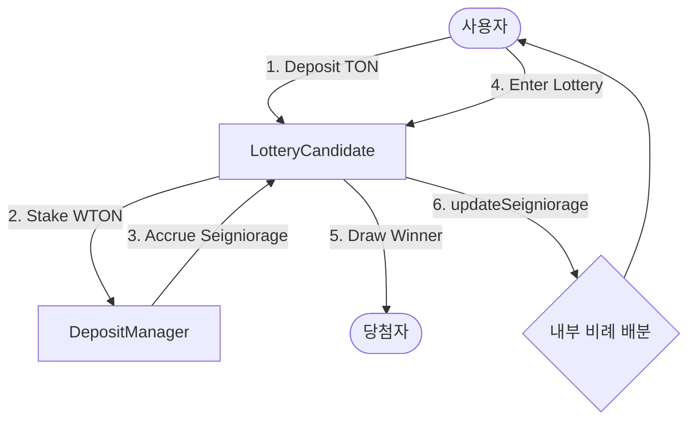

# 🎰 LotteryCandidate: Staking-Based Lossless Lottery

[English Version Available here](./en/README.md)

`LotteryCandidate`는 Tokamak Network의 스테이킹 생태계를 활용한 **"원금 손실 없는 로터리(Lossless Lottery)"** 모델입니다. 사용자는 자신의 TON을 스테이킹하여 네트워크 보상(시뇨리지)을 받는 동시에, 매 라운드 추첨을 통해 추가적인 상금을 획득할 기회를 가집니다.

---

## 🌟 개요

기존 로또는 참가비가 소멸되지만, `LotteryCandidate`는 **차감형 잔액 관리**와 **시뇨리지 분배**를 결합하여 독특한 가치를 제공합니다.

- **원금 보존**: 로터리에 참여하지 않은 잔액은 시뇨리지를 통해 지속적으로 증식합니다.
- **게임화된 스테이킹**: 단순히 보상을 기다리는 대신, 스테이킹된 자산의 일부를 활용하여 로터리에 참여함으로써 더 큰 수익을 노릴 수 있습니다.
- **투명한 운영**: 모든 추첨 로직과 보상 분배는 스마트 컨트랙트에 의해 온체인에서 투명하게 관리됩니다.

---

## ⚙️ 핵심 메커니즘

### 1. 통합 스테이킹 관리
사용자가 `LotteryCandidate`에 TON을 예치하면, 컨트랙트는 이를 WTON으로 변환하여 Tokamak Network의 `DepositManager`에 일괄 스테이킹합니다. 이를 통해 컨트랙트 전체가 하나의 거대한 스테이킹 풀로 작동하며 네트워크 보상을 축적합니다.

### 2. 차감형 로터리 (Winner-Takes-All)
- 사용자는 내부 잔액 내에서 정해진 참여 비용(`entryFee`)을 지불하고 라운드에 참여합니다.
- 당첨자는 해당 라운드의 모든 참가자가 낸 비용(Prize Pool)을 독식합니다.
- 탈락하더라도 예치한 원금 자체는 안전하게 유지되며, 다음 라운드에 다시 참여하거나 언제든 출금할 수 있습니다.

### 3. 비례적 시뇨리지 분배 (Rebase System)
Tokamak Network에서 발생하는 시뇨리지는 `LotteryCandidate` 컨트랙트의 코이니지(Coinage) 잔액을 증가시킵니다. `LotteryCandidate`는 이 증가분을 감지하여 **현재 모든 예치자의 잔액 비율에 맞춰 자동으로 분배**합니다. 로터리 참여 여부와 관계없이 모든 예치자가 혜택을 공유합니다.

---

## 🏗️ 시스템 아키텍처



---

## 📂 문서 가이드

프로젝트의 상세 내용을 확인하려면 아래 문서를 참조하십시오.

| 문서 | 핵심 내용 |
| :--- | :--- |
| [**Contracts 상세**](contracts.md) | `LotteryCandidate.sol`의 함수 명세, 스토리지 구조 및 상속 관계 |
| [**사용 시나리오**](scenario.md) | 초기 설정부터 예치, 로터리 참여, 시뇨리지 수령까지의 전체 사용자 여정 |
| [**프론트엔드 데모**](demo.md) | 로컬 환경에서 React 앱을 실행하고 기능을 직접 테스트하는 방법 |

---

## 🚀 빠른 시작 (Quick Start)

로컬 환경에서 바로 데모를 실행해보세요.

```bash
# 1. 저장소 클론 및 빌드
git clone https://github.com/tokamak-network/ton-staking-v2.git
cd ton-staking-v2
forge build

# 2. 원클릭 데모 실행 (Anvil + Deploy + Frontend)
chmod +x run-lottery-demo.sh
./run-lottery-demo.sh
```

데모 실행 후 [http://localhost:5173](http://localhost:5173)에서 로터리 시스템을 직접 체험할 수 있습니다.
