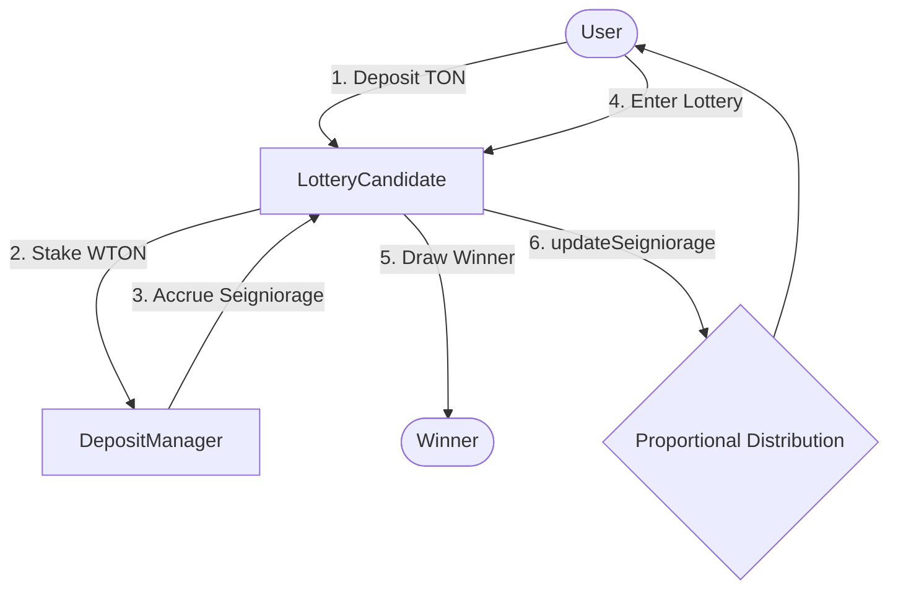

# 🎰 LotteryCandidate: Staking-Based Lossless Lottery

`LotteryCandidate` is a **"Lossless Lottery"** model built upon the Tokamak Network staking ecosystem. Users can stake their TON to receive network rewards (seigniorage) while having a chance to win additional prizes through a per-round drawing system.

---

## 🌟 Overview

Unlike traditional lotteries where the entry fee is lost, `LotteryCandidate` provides unique value by combining **deductible balance management** with **seigniorage distribution**.

- **Principal Preservation**: Balances not spent on lottery entries continue to grow through seigniorage.
- **Gamified Staking**: Instead of just waiting for rewards, users can use a portion of their staked assets to participate in the lottery for higher potential returns.
- **Transparent Operation**: All drawing logic and reward distribution are managed transparently on-chain by smart contracts.

---

## ⚙️ Core Mechanisms

### 1. Integrated Staking Management
When a user deposits TON into `LotteryCandidate`, the contract converts it to WTON and stakes it into the Tokamak Network `DepositManager` as a single pool. This allows the entire contract to act as one large staking entity, accumulating network rewards.

### 2. Deductible Lottery (Winner-Takes-All)
- Users pay a fixed entry fee (`entryFee`) from their internal balance to participate in a round.
- The winner takes the entire Prize Pool (sum of all entry fees in that round).
- Even if a user loses, their principal stake remains safe and can be used for the next round or withdrawn at any time.

### 3. Proportional Seigniorage Distribution (Rebase System)
Seigniorage generated from the Tokamak Network increases the Coinage balance of the `LotteryCandidate` contract. The contract detects this increase and **automatically distributes it to all internal depositors proportional to their current balance**. Every depositor benefits, regardless of lottery participation.

---

## 🏗️ System Architecture



---

## 📂 Documentation Map

Refer to the documents below for detailed information.

| Document | Core Content |
| :--- | :--- |
| [**Contracts Details**](contracts.md) | `LotteryCandidate.sol` function specifications, storage structure, and inheritance. |
| [**Usage Scenario**](scenario.md) | The entire user journey from initial setup to deposit, entry, and claiming seigniorage. |
| [**Frontend Demo**](demo.md) | Guide to running the React app in a local environment and testing features directly. |
| [**Troubleshooting**](seigniorage-troubleshooting.md) | Analysis and solutions for issues when seigniorage distribution is not working. |

---

## 🚀 Quick Start

Try the demo directly in your local environment.

```bash
# 1. Clone repository and build
git clone https://github.com/tokamak-network/ton-staking-v2.git
cd ton-staking-v2
forge build

# 2. Run one-click demo (Anvil + Deploy + Frontend)
chmod +x run-lottery-demo.sh
./run-lottery-demo.sh
```

After running the demo, experience the lottery system at [http://localhost:5173](http://localhost:5173).
