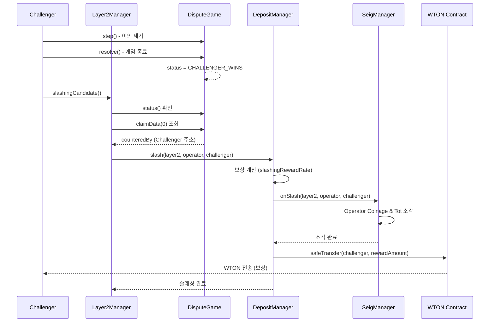

# Slashing Mechanism & slashingCandidate Process (현재 개발사항)

## 1. Slashing Mechanism Overview

Slashing 메커니즘은 Layer 2 네트워크의 보안을 유지하기 위한 핵심 기능입니다. Optimism Bedrock 아키텍처의 `FaultDisputeGame`을 기반으로 작동하며, 다음과 같은 시나리오에서 발생합니다:

1.  **Fault Dispute Game**: Layer 2의 상태(State)에 대한 이의 제기(Challenge)가 발생하여 게임이 시작됩니다.
2.  **Challenger Wins**: 게임 결과, 이의를 제기한 Challenger가 승리합니다. 이는 Operator가 제출한 State Root가 유효하지 않음을 의미합니다.
3.  **Slashing**: Challenger가 승리한 경우, 해당 Layer 2를 운영하는 Operator의 Deposit(예치금)이 Slashing(삭감)됩니다.
4.  **Reward**: Slashing된 금액의 일부는 정당한 이의를 제기한 Challenger에게 보상으로 지급됩니다.

## 2. slashingCandidate 함수 실행 과정 (Layer2Manager)

`Layer2ManagerV1_Slashing.sol` 컨트랙트의 `slashingCandidate` 함수는 위 메커니즘을 온체인 상에서 검증하고 실행하는 진입점입니다.

### 함수 시그니처
```solidity
function slashingCandidate(
    address _operator,
    GameType _gameType,
    Claim _rootClaim,
    bytes calldata _extraData,
    address _disputeGame
) external
```

### 상세 실행 단계

**Step 1: Operator 및 DisputeGameFactory 확인**
*   입력받은 `_operator` 주소가 유효한지 확인합니다.
*   Operator와 연결된 `RollupConfig` 컨트랙트(`ISystemConfig`)를 통해 해당 네트워크의 `DisputeGameFactory` 주소를 조회합니다.
    ```solidity
    address disputeGameFactory = ISystemConfig(operatorInfo[_operator].rollupConfig).disputeGameFactory();
    ```

**Step 2: DisputeGame 유효성 검증**
*   조회한 `DisputeGameFactory`에 `games` 함수를 호출하여, 입력받은 파라미터(`_gameType`, `_rootClaim`, `_extraData`)에 해당하는 `DisputeGame` 주소를 가져옵니다.
*   Factory에서 반환된 주소와 사용자가 입력한 `_disputeGame` 주소가 일치하는지 검증합니다. 이는 임의의 가짜 게임 컨트랙트로 Slashing을 시도하는 것을 방지합니다.
    ```solidity
    (IDisputeGame disputeGame,) = IDisputeGameFactory(disputeGameFactory).games(_gameType, _rootClaim, _extraData);
    require(address(disputeGame) == _disputeGame, "wrong dispute game Address");
    ```

**Step 3: 게임 결과(Status) 확인**
*   검증된 `DisputeGame` 컨트랙트의 `status()`를 호출하여 현재 게임 상태를 확인합니다.
*   상태가 반드시 `CHALLENGER_WINS`여야 합니다. 만약 게임이 진행 중이거나 Defender가 승리한 경우 Slashing은 실행되지 않고 revert 됩니다.
    ```solidity
    GameStatus status = IDisputeGame(disputeGame).status();
    if (status != GameStatus.CHALLENGER_WINS) revert StatusError();
    ```

**Step 4: Slashing 실행 (DepositManager 호출)**
*   모든 검증이 통과되면 `DepositManager`의 `slash` 함수를 호출하여 Operator의 자산을 삭감합니다.
    ```solidity
    if (!IIDepositManager(depositManager).slash(operatorInfo[_operator].candidateAddOn, _operator)) revert SlashingError();
    ```

---

## 3. DepositManager Slash 분석

`DepositManagerV1_Slash.sol`의 `slash` 함수는 `Layer2Manager`로부터 호출받아 실제 Operator의 예치금(Stake) 기록을 삭감하는 역할을 합니다.

### 함수 시그니처
```solidity
function slash(address layer2, address operator) external onlyLayer2Manager returns (bool)
```

### 상세 실행 단계

**Step 1: Operator 검증**
*   입력받은 `operator`가 해당 `layer2`의 실제 Operator인지 확인합니다.
    ```solidity
    require(operator == ILayer2(layer2).operator(), "operator is not an operator");
    ```

**Step 2: 내부 회계 장부(Accounting) 초기화**
*   `DepositManager`가 관리하는 Operator의 스테이킹 관련 매핑 데이터를 0으로 초기화하거나 차감합니다.
    *   `_accStaked[layer2][operator] = 0`: 해당 Layer2에서 Operator의 스테이킹 금액을 0으로 만듭니다.
    *   `_accStakedLayer2[layer2]`: Layer2 전체 스테이킹 총액에서 Operator 금액만큼 차감합니다.
    *   `_accStakedAccount[operator]`: Operator 계정의 전체 스테이킹 총액에서 차감합니다.

**Step 3: SeigManager에 Slashing 전파**
*   실제 토큰(Coinage) 소각을 위해 `SeigManager`의 `onSlash` 함수를 호출합니다.
    ```solidity
    require(ISeigManager(_seigManager).onSlash(layer2, operator), "fail onSlash");
    ```

---

## 4. SeigManager onSlash 분석

`SeigManagerV1_Slashing.sol`의 `onSlash` 함수는 `DepositManager`로부터 호출받아 실제 발행된 토큰(Coinage)과 전체 지분(Tot)을 소각(Burn)합니다.

### 함수 시그니처
```solidity
function onSlash(address layer2, address operator) external onlyDepositManager returns (bool)
```

### 상세 실행 단계

**Step 1: Operator의 Coinage 잔액 조회**
*   해당 Layer2에 대한 Operator의 Coinage(지분 토큰) 잔액을 확인합니다.
    ```solidity
    uint256 operatorAmount = _coinages[layer2].balanceOf(operator);
    ```

**Step 2: Tot 토큰 소각 (전체 지분 감소)**
*   `_tot`은 모든 Layer2의 전체 스테이킹 지분을 나타내는 토큰입니다.
*   `_additionalTotBurnAmount`를 계산하여, Operator의 원금뿐만 아니라 그동안 누적된 Seigniorage(이자)에 해당하는 부분까지 포함하여 `_tot` 토큰을 소각합니다.
    ```solidity
    uint256 totAmount = _additionalTotBurnAmount(layer2, operator, operatorAmount);
    _tot.burnFrom(layer2, operatorAmount + totAmount);
    ```

**Step 3: Coinage 토큰 소각 (개별 지분 삭제)**
*   해당 Layer2 내에서 Operator의 지분을 나타내는 `_coinages[layer2]` 토큰을 전량 소각합니다.
    ```solidity
    _coinages[layer2].burnFrom(operator, operatorAmount);
    ```

### 결과
이 과정을 통해 Operator는 해당 Layer2에 예치했던 모든 자산과 누적된 보상을 잃게 되며, 시스템 전체의 총 발행량(Total Supply)이 감소하게 됩니다.

---

## 5. Challenger 보상 메커니즘

Slashing이 발생하면 정당한 이의를 제기한 Challenger에게 보상이 지급됩니다. 이는 네트워크 보안 유지에 기여한 참여자에게 인센티브를 제공하기 위함입니다.

### 5.1 보상 흐름 개요

```
Layer2Manager.slashingCandidate()
    ↓ (Challenger 주소 추출)
DepositManager.slash(layer2, operator, challenger)
    ↓ (보상 계산 및 WTON 전송)
SeigManager.onSlash() (Operator 자산 소각)
    ↓
Challenger에게 WTON 보상 지급 완료
```

### 5.2 Challenger 주소 추출 (Layer2Manager)

`slashingCandidate` 함수는 `FaultDisputeGame`의 `claimData(0).counteredBy`를 통해 승리한 Challenger의 주소를 추출합니다.

```solidity
function _getWinningChallenger(address disputeGame) internal view returns (address challenger) {
    // claimData(0)은 루트 클레임이며, counteredBy는 이를 격파한 챌린저의 주소
    (, address counteredBy, , , , , ) = IFaultDisputeGame(disputeGame).claimData(0);
    return counteredBy;
}
```

**핵심 원리:**
- `claimData(0)`: 디펜더(Operator)가 제출한 루트 클레임
- `claimData(0).counteredBy`: 루트 클레임을 최종적으로 격파한 Challenger의 주소
- 여러 명의 Challenger가 있더라도, 최종 승리자는 `counteredBy`에 기록됨

### 5.3 보상 계산 및 지급 (DepositManager)

`slash` 함수는 슬래싱된 금액 중 일부를 Challenger 보상으로 계산하고, **WTON을 직접 전송**합니다.

```solidity
function slash(address layer2, address operator, address challenger) external onlyLayer2Manager returns (bool) {
    uint256 slashedAmount = _accStaked[layer2][operator];
    
    // 보상 금액 계산 (slashingRewardRate가 0이면 보상 없음)
    uint256 rewardAmount = 0;
    if (slashingRewardRate > 0) {
        // RAY 단위로 계산: slashedAmount * slashingRewardRate / RAY
        rewardAmount = (slashedAmount * slashingRewardRate) / 1e27;
    }
    
    // 회계 장부 초기화
    _accStaked[layer2][operator] = 0;
    _accStakedLayer2[layer2] = _accStakedLayer2[layer2] - slashedAmount;
    _accStakedAccount[operator] = _accStakedAccount[operator] - slashedAmount;
    
    // SeigManager에 슬래싱 처리 요청
    require(ISeigManager(_seigManager).onSlash(layer2, operator, challenger), "fail onSlash");
    
    // Challenger에게 보상 지급 (WTON 직접 전송)
    if (rewardAmount > 0) {
        IERC20(_wton).safeTransfer(challenger, rewardAmount);
    }
    
    emit Slashed(layer2, operator, challenger, slashedAmount, rewardAmount);
}
```

**보상 비율 (slashingRewardRate):**
- RAY 단위 (1e27 = 100%)
- 기본값 예시: 0.1e27 = 10%
- Owner가 `setSlashingRewardRate()` 함수로 조정 가능

**중요:** DepositManager는 WTON을 보유하고 있어야 하며, 보상은 **기존 WTON을 전송**하는 방식입니다. 새로운 WTON을 민팅하지 않습니다.

### 5.4 보상 비율 설정

Owner는 `DepositManager`의 `setSlashingRewardRate` 함수를 통해 보상 비율을 조정할 수 있습니다.

```solidity
function setSlashingRewardRate(uint256 newRate) external onlyOwner {
    require(newRate <= RAY, "rate exceeds 100%");
    slashingRewardRate = newRate;
    emit SlashingRewardRateSet(newRate);
}
```

**예시:**
- 10% 보상: `setSlashingRewardRate(100000000000000000000000000)` (0.1e27)
- 5% 보상: `setSlashingRewardRate(50000000000000000000000000)` (0.05e27)
- 20% 보상: `setSlashingRewardRate(200000000000000000000000000)` (0.2e27)

### 5.5 이벤트

Slashing 및 보상 과정에서 다음 이벤트들이 발생합니다:

```solidity
// Layer2Manager
event CandidateSlashed(address indexed operator, address indexed challenger, address disputeGame);

// DepositManager
event Slashed(address indexed layer2, address indexed operator, address indexed challenger, uint256 slashedAmount, uint256 rewardAmount);
event SlashingRewardRateSet(uint256 newRate);

// SeigManager
event Slashed(address layer2, address challenger);
```

### 5.6 보상 메커니즘 요약

| 단계 | 컨트랙트 | 주요 동작 |
|------|----------|-----------|
| 1 | Layer2Manager | DisputeGame 검증 및 Challenger 주소 추출 |
| 2 | DepositManager | 슬래싱 금액 계산, 보상 비율 적용, **WTON 직접 전송** |
| 3 | SeigManager | Operator 자산 소각 (Coinage + Tot) |

**보상 계산 예시:**
- Operator 스테이킹 금액: 1,000 WTON
- 보상 비율: 10%
- Challenger 보상: 100 WTON (**DepositManager가 보유한 WTON에서 전송**)
- 소각 금액: 1,000 WTON (원금) + 누적 Seigniorage

**주의사항:**
- DepositManager는 충분한 WTON 잔액을 보유해야 합니다
- 보상은 새로운 WTON 민팅이 아닌 기존 WTON 전송입니다
- 보상 비율이 0이면 보상 없이 전액 소각됩니다

---

## 6. 전체 Slashing & Reward 프로세스




