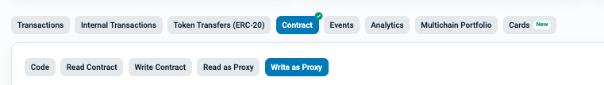

## Seigniorage related functions

> You can execute the below functions through the **Write as Proxy** page of the SeigManagerProxy contract.
>
- SeigManagerProxy : [etherscan link](https://etherscan.io/address/0x0b55a0f463b6defb81c6063973763951712d0e5f#writeProxyContract)

> Before executing the execution function, first connect your wallet.

### [updateSeigniorageLayer (address layer2)](https://etherscan.io/address/0x0b55a0f463b6defb81c6063973763951712d0e5f?#writeProxyContract#F50)
Distributes seigniorage to accounts that have staked TON on a specific layer.
 - Parameters
   -  layer2 (address) : Layer Address

