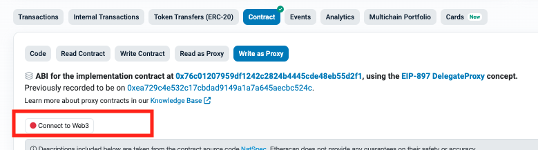

## Staking related functions

> You can execute the below functions through the **Write as Proxy** page of the DepositManagerProxy contract.
>
- DepositManagerProxy : [etherscan link](https://etherscan.io/address/0x0b58ca72b12f01fc05f8f252e226f3e2089bd00e#writeProxyContract)

> Before executing the execution function, first connect your wallet.

### [deposit (address layer2, uint256 amount)](https://etherscan.io/address/0x0b58ca72b12f01fc05f8f252e226f3e2089bd00e?#writeProxyContract#F2)
Staking with **WTON** on a specific layer.
Before staking, you need to approve your WTON to be used by the depositManagerProxy.

- [approve of WTON](https://etherscan.io/address/0xc4A11aaf6ea915Ed7Ac194161d2fC9384F15bff2?#writeContract#F2)
  - parameters
    - spender (address): [0x0b58ca72b12f01fc05f8f252e226f3e2089bd00e](https://etherscan.io/address/0x0b58ca72b12f01fc05f8f252e226f3e2089bd00e), DepositManagerProxy address
    - amount (uint256): Staking amount, enter in RAY(10^27 decimals) units

- [deposit(address layer2, uint256 amount)](https://etherscan.io/address/0x0b58ca72b12f01fc05f8f252e226f3e2089bd00e?#writeProxyContract#F2)
  - parameters
    - layer2 (address): [Layer address](../deployed-addresses-mainnet.md#layer-addresses)
    - amount (uint256): Staking amount, enter in RAY(10^27 decimals) units

### [TON.approveAndCall (address spender, uint256 amount, bytes data)](https://etherscan.io/address/0x2be5e8c109e2197d077d13a82daead6a9b3433c5?#writeContract#F3)
Staking with **TON** on a specific layer.
  - parameters
    - spender (address): 0xc4A11aaf6ea915Ed7Ac194161d2fC9384F15bff2 [WTON address](https://etherscan.io/address/0xc4a11aaf6ea915ed7ac194161d2fc9384f15bff2)
    - amount (uint256): Staking amount, enter in Wei(10^18 decimals) units
    - data (bytes):

### requestWithdrawal (address layer2, uint256 amount)

### redeposit (address layer2)

### processRequest (address layer2, bool receiveTON)

