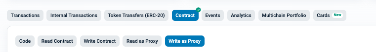
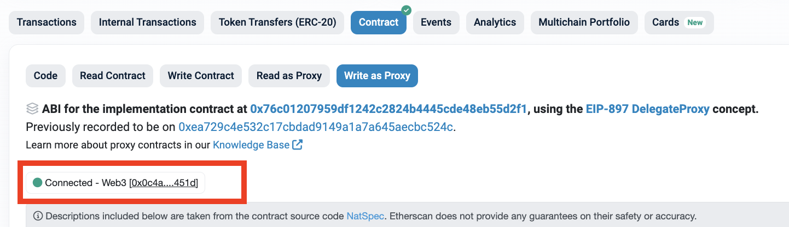

## Staking related functions

> You can execute the below functions through the **Write as Proxy** page of the DepositManagerProxy contract.
>
- DepositManagerProxy : [etherscan link](https://etherscan.io/address/0x0b58ca72b12f01fc05f8f252e226f3e2089bd00e#writeProxyContract)

### Connect Wallet

> Before executing the execution function, first connect your wallet.

### [TON.approveAndCall (address spender, uint256 amount, bytes data)](https://etherscan.io/address/0x2be5e8c109e2197d077d13a82daead6a9b3433c5?#writeContract#F3)
Staking with **TON** on a specific layer.
  - parameters
    - spender (address): 0xc4A11aaf6ea915Ed7Ac194161d2fC9384F15bff2 [WTON address](https://etherscan.io/address/0xc4a11aaf6ea915ed7ac194161d2fc9384f15bff2)
    - amount (uint256): Staking amount, input in Wei(10^18 decimals) units
    - data (bytes): DepositManager address (32 bytes) + layer address (32 bytes) 
 If layer address is 0F42D1C40b95DF7A1478639918fc358B4aF5298D, input
    0x0000000000000000000000000b58ca72b12F01FC05F8f252e226f3E2089BD00E0000000000000000000000000F42D1C40b95DF7A1478639918fc358B4aF5298D

### [deposit (address layer2, uint256 amount)](https://etherscan.io/address/0x0b58ca72b12f01fc05f8f252e226f3e2089bd00e?#writeProxyContract#F2)
Staking with **WTON** on a specific layer.
Before staking, you need to approve your WTON to be used by the depositManagerProxy.

- [approve of WTON](https://etherscan.io/address/0xc4A11aaf6ea915Ed7Ac194161d2fC9384F15bff2?#writeContract#F2)
  - parameters
    - spender (address): [0x0b58ca72b12f01fc05f8f252e226f3e2089bd00e](https://etherscan.io/address/0x0b58ca72b12f01fc05f8f252e226f3e2089bd00e), DepositManagerProxy address
    - amount (uint256): Staking amount, input in RAY(10^27 decimals) units 

                        When trying to stake 1 (W)TON, if you input in RAY units, you should input
1000000000000000000000000000

- [deposit(address layer2, uint256 amount)](https://etherscan.io/address/0x0b58ca72b12f01fc05f8f252e226f3e2089bd00e?#writeProxyContract#F2)
  - parameters
    - layer2 (address): [Layer address](../deployed-addresses-mainnet.md#layer-addresses)
    - amount (uint256): Staking amount, input in RAY(10^27 decimals) units

                        When trying to stake 1 (W)TON, if you input in RAY units, you should input
1000000000000000000000000000

### [deposit (address layer2, address[] accounts, uint256[] amounts)](https://etherscan.io/address/0x0b58ca72b12f01fc05f8f252e226f3e2089bd00e?#writeProxyContract#F3)
Staking with **WTON** to accounts specified on a specific layer.
Before staking, you need to approve the total amount of WTON you want to stake to be used by the depositManagerProxy.

- [approve of WTON](https://etherscan.io/address/0xc4A11aaf6ea915Ed7Ac194161d2fC9384F15bff2?#writeContract#F2)
  - parameters
    - spender (address): [0x0b58ca72b12f01fc05f8f252e226f3e2089bd00e](https://etherscan.io/address/0x0b58ca72b12f01fc05f8f252e226f3e2089bd00e), DepositManagerProxy address
    - amount (uint256): Staking amount, input in RAY(10^27 decimals) units 

                        When trying to stake 1 (W)TON, if you input in RAY units, you should input
1000000000000000000000000000

- [deposit(address layer2, address[] accounts, uint256[] amounts)](https://etherscan.io/address/0x0b58ca72b12f01fc05f8f252e226f3e2089bd00e?#writeProxyContract#F2)
  - parameters
    - layer2 (address): [Layer address](../deployed-addresses-mainnet.md#layer-addresses)
    - accounts (address[]): Account address array 

      
 If you stake 1 WTON at 0xab000000000000000000000000000000000000012 and 2 WTON at 0xcd000000000000000000000000000000000000000034 
 input
      [0xab000000000000000000000000000000000000012,0xcd000000000000000000000000000000000000000034]
    - amounts (uint256[]): Staking amount array, input in RAY(10^27 decimals) units

      
 If you stake 1 WTON at 0xab000000000000000000000000000000000000012 and 2 WTON at 0xcd000000000000000000000000000000000000000034 
 input
      [1000000000000000000000000000,2000000000000000000000000000]

### [requestWithdrawal (address layer2, uint256 amount)](https://etherscan.io/address/0x0b58ca72b12f01fc05f8f252e226f3e2089bd00e?#writeProxyContract#F15)
Request withdrawal the amount you input from the amount staked in a specific layer.
To withdraw, you must 'requestWithdrawal' and wait for [a delay block](./view-functions.md#getdelayblocks-address-layer2) to pass before withdrawing.

  - parameters
    - layer2 (address): [Layer address](../deployed-addresses-mainnet.md#layer-addresses)
    - amount (uint256): Withdrawal request amount

### [redeposit (address layer2)](https://etherscan.io/address/0x0b58ca72b12f01fc05f8f252e226f3e2089bd00e?#writeProxyContract#F10)
Re-deposit the oldest pending requests in the pending queue.

  - parameters
    - layer2 (address): [Layer address](../deployed-addresses-mainnet.md#layer-addresses)

### [redepositMulti (address layer2)](https://etherscan.io/address/0x0b58ca72b12f01fc05f8f252e226f3e2089bd00e?#writeProxyContract#F11)
Re-deposit oldest n pending requests in the pending queue.

  - parameters
    - layer2 (address): [Layer address](../deployed-addresses-mainnet.md#layer-addresses)
    - n (uint256): oldest n pending requests

### [processRequest (address layer2, bool receiveTON)](https://etherscan.io/address/0x0b58ca72b12f01fc05f8f252e226f3e2089bd00e?#writeProxyContract#F8)
The oldest withdrawal request will be processed for withdrawal.

  - parameters
    - layer2 (address): [Layer address](../deployed-addresses-mainnet.md#layer-addresses)
    - receiveTON (bool): If receiveTON is true, you will receive TON for withdrawal, otherwise receive WTON.

### [processRequests (address layer2,  uint256 n, bool receiveTON)](https://etherscan.io/address/0x0b58ca72b12f01fc05f8f252e226f3e2089bd00e?#writeProxyContract#F9)
Oldest n withdrawal request will be processed for withdrawal.

  - parameters
    - layer2 (address): [Layer address](../deployed-addresses-mainnet.md#layer-addresses)
    - n (uint256): oldest n pending requests
    - receiveTON (bool): If receiveTON is true, you will receive TON for withdrawal, otherwise receive WTON.

