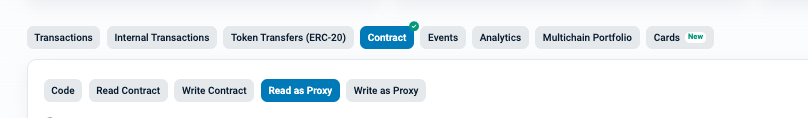

# TON staking contract query function

> You can query the below functions through the **Read as Proxy** page of the SeigManagerProxy contract.
>
- SeigManagerProxy : [etherscan link](https://etherscan.io/address/0x0b55a0f463b6defb81c6063973763951712d0e5f#readProxyContract)

## Staking amount query functions

### [stakeOf (address account)](https://etherscan.io/address/0x0b55a0f463b6defb81c6063973763951712d0e5f?#readProxyContract#F53)
The amount staked by a specific account
- Parameters
  - account (address) : Account address
- Result
  - Staking amount, expressed in decimals RAY units (10^27).

---

### [stakeOf (address layer2, address account)](https://etherscan.io/address/0x0b55a0f463b6defb81c6063973763951712d0e5f?#readProxyContract#F54)
The amount staked by a specific account on a specific layer
- Parameters
  - layer2 (address) : Layer Address
  - account (address) : Account address
- Result
  - (uint256) : Staking amount, expressed in decimals RAY units (10^27).

---

### (coinages (address layer2)).totalSupply()
Total staked amount in a particular layer
 After searching for the coinage address of the layer, look up the totalSupply of the coinage contract.

- Parameters
  - layer2 (address) : Layer Address
- Result
  - (uint256) : Staking amount, expressed in decimals RAY units (10^27).

---

### [stakeOfTotal ()](https://etherscan.io/address/0x0b55a0f463b6defb81c6063973763951712d0e5f?#readProxyContract#F59)
Total staked amount (based on seigniorage issuance)
- Parameters
  - none
- Result
  - (uint256) : Staking amount, expressed in decimals RAY units (10^27).

---

### [stakeOfAllLayers ()](https://etherscan.io/address/0x0b55a0f463b6defb81c6063973763951712d0e5f?#readProxyContract#F55)
Total staked amount (based on seigniorage distribution)
- Parameters
  - none
- Result
  - (uint256) : Staking amount, expressed in decimals RAY units (10^27).

---

## Layer information query functions

### [coinages (address layer2)](https://etherscan.io/address/0x0b55a0f463b6defb81c6063973763951712d0e5f?#readProxyContract#F18)
Look up the coinage (seigniorage held) contract address of the layer
- Parameters
  - layer2 (address) : Layer Address
- Result
  - (address) : Coinage contract address

---

### [commissionRates (address layer2)](https://etherscan.io/address/0x0b55a0f463b6defb81c6063973763951712d0e5f?#readProxyContract#F19)
View operator commission rates for layers
- Parameters
  - layer2 (address) : Layer Address
- Result
  - (uint256) : commission rates, expressed in RAY units (10^27)

---

### [lastCommitBlock (address layer2)](https://etherscan.io/address/0x0b55a0f463b6defb81c6063973763951712d0e5f?#readProxyContract#F37)
The block number that recently distributed seigniorage at a specific layer
- Parameters
  - layer2 (address) : Layer Address
- Result
  - (uint256) : the block number

---

## Other lookup functions

### [seigPerBlock ()](https://etherscan.io/address/0x0b55a0f463b6defb81c6063973763951712d0e5f?#readProxyContract#F50)
Seigniorage issuance per block
- Parameters
  - none
- Result
  - (uint256) : the issuance amount, expressed in decimals RAY units (10^27).

---

### [lastSeigBlock ()](https://etherscan.io/address/0x0b55a0f463b6defb81c6063973763951712d0e5f?#readProxyContract#F38)
The block number where the most recent seigniorage was distributed
- Parameters
  - none
- Result
  - (uint256) : the block number

---

### [totalSupplyOfTon ()](https://etherscan.io/address/0x0b55a0f463b6defb81c6063973763951712d0e5f?#readProxyContract#F64)
Total Supply of TON (including seigniorage issuance)
 - Parameters
  - none
- Result
  - (uint256) : the total amount, expressed in decimals RAY units (10^27).

---
